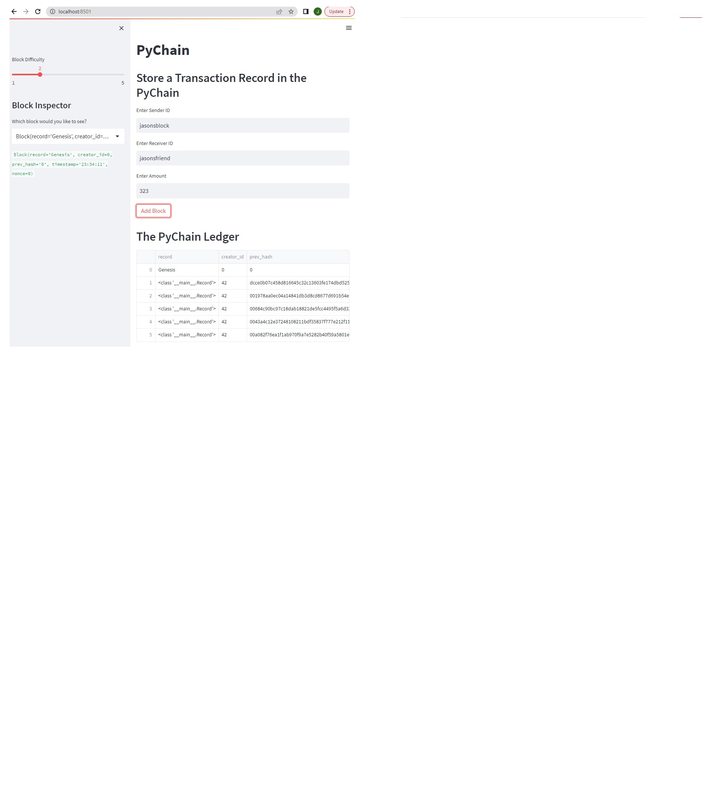
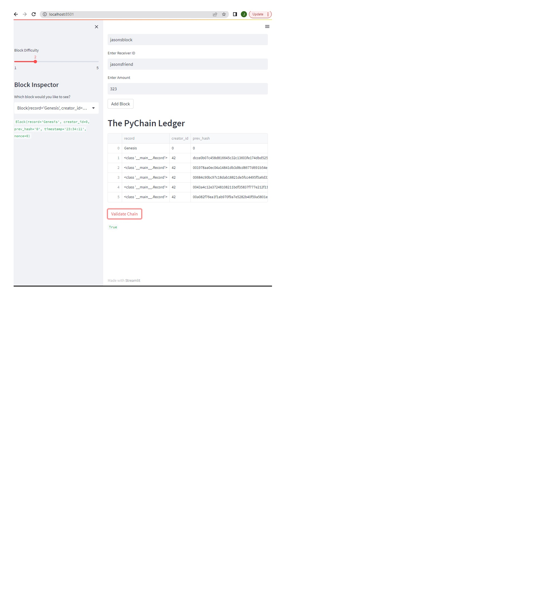

# Blockchain-Based Ledger in Streamlit

### The purpose of this application is to allow users to input transactions (sender id, receiver id, and amount being transacted), and store those records in a blockchain with a verifiable ledger. Running this .py code requires installation of pandas and streamlit in a python 3.9 environment. 

---

# How it works:

### A record dataclass is created to include sender, receiver, and amount info. The hashlib function sha256() is used to create the hash for each block. New blocks validated using a proof-of-work model to attain a winning hash. The block difficulty slider on the sidebar of the app can be used to increase the amount of work required to mine a new block. After the block is added to the chain using the 'add block' button, the new block can be viewed in the updated pychain ledger. After all transaction blocks have been added, the chain can be validated based on the hash of previous blocks using the 'validate chain' button. If a value of 'True' is returned, the chain is valid.

## To run this application, in terminal run: streamlit run pychain.py. Then input sender, receiver, and amount of transaction and click 'add block'. After all transactions added, as seen in ledger, click 'validate chain' to determine if chain is valid.

## Example adding transaction block to ledger: 

## Example validating chain:

---
## MIT License
